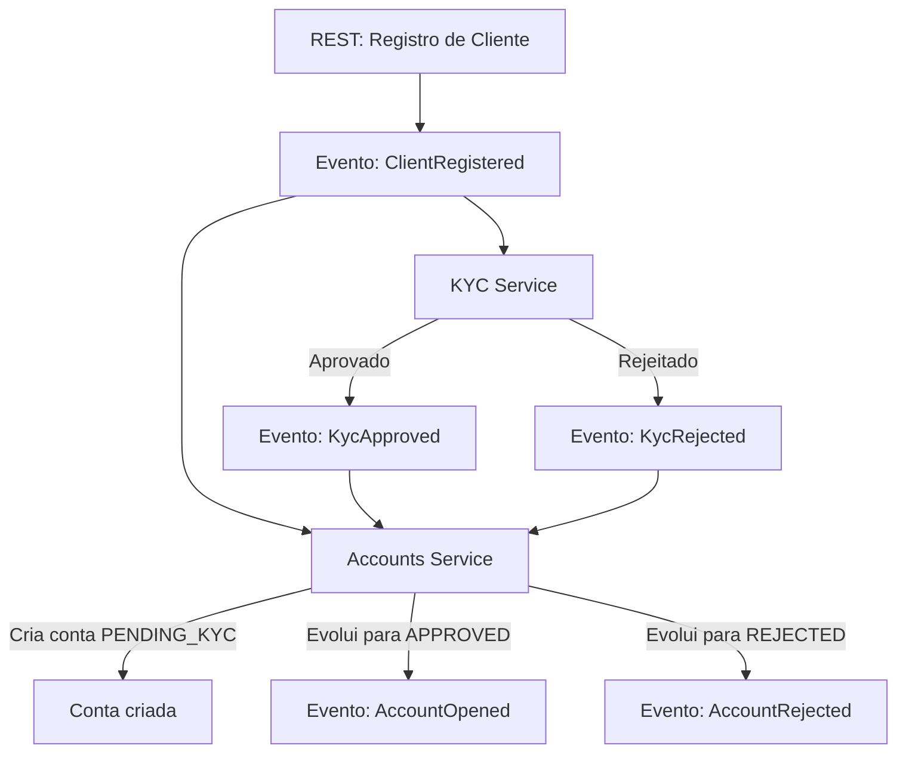

# Orquestração de Eventos

## Fluxo
1. O cliente é registrado via REST, gerando o evento `ClientRegistered`.
2. Tanto o serviço de KYC quanto o serviço de Accounts consomem esse evento.
3. Accounts cria a conta com status `PENDING_KYC`.
4. KYC processa e gera evento de aprovação (`KycApproved`) ou rejeição (`KycRejected`).
5. Accounts consome o evento de KYC e evolui o status da conta para `APPROVED` ou `REJECTED`, gerando o evento correspondente (`AccountOpened` ou `AccountRejected`).
6. Se receber um evento de KYC após a conta já estar em estado final (`REJECTED` ou `APPROVED`), ignora (idempotente).

## Estratégia de Correlation e Causation
- `correlationId`: nasce no `ClientRegistered` e é propagado em todos os eventos subsequentes.
- `causationId`: sempre é o `eventId` do evento imediatamente anterior.

## Deduplicação
- Por `eventId` (garante que o mesmo evento não seja processado duas vezes).
- Por agregado (`aggregateId` + `type`) para garantir que não haja evolução duplicada para o mesmo estado.

## Estados e Transições
- Estados possíveis: `PENDING_KYC`, `APPROVED`, `REJECTED`.
- Transições válidas:
  - `PENDING_KYC` → `APPROVED` (com `KycApproved`)
  - `PENDING_KYC` → `REJECTED` (com `KycRejected`)
- Transições inválidas:
  - Qualquer evento de KYC recebido após a conta estar em `APPROVED` ou `REJECTED` deve ser ignorado (idempotente).

Cada etapa é desacoplada e baseada em eventos, permitindo evolução e integração de novos módulos.
